# INPT Ride

INPT Ride is a campus bike and scooter rental platform built as an end-to-end academic and DevOps/Cloud portfolio project.

The project addresses a real campus need: replacing informal WhatsApp group messages for bike and scooter reservations with a structured platform for availability tracking, reservations, ride management, wallet payments, and admin supervision.

It combines:

- a **Flutter student mobile app**
- a **React + Vite admin dashboard**
- a **Django REST Framework backend**
- a **PostgreSQL database**
- **Redis** for reservation locking and concurrency protection
- **Nginx** for serving the admin dashboard and reverse proxying API requests
- a **wallet-based billing and invoice flow**
- **Dockerized application services**
- **Jenkins DevSecOps pipelines**
- **SonarCloud quality gate analysis**
- **Docker Hub image publishing**
- **Kubernetes deployment on Minikube**
- **Argo CD GitOps synchronization**

---

## Overview

INPT Ride allows authorized students to reserve a bike or scooter, start a ride at the campus station, end the ride after use, and pay automatically through their wallet balance.

On the admin side, the platform provides management and monitoring tools for:

- vehicles
- authorized students
- user profiles
- reservations
- rides
- wallet operations
- pricing rules
- invoices
- analytics

The project also includes a complete DevOps and DevSecOps workflow around the application:

- Dockerized Django backend
- Dockerized React admin dashboard served by Nginx
- PostgreSQL and Redis services
- Nginx reverse proxy for `/api` requests
- Jenkins backend/admin DevSecOps pipeline
- Jenkins mobile CI pipeline
- SonarCloud code quality gate through GitHub Actions
- secret scanning
- Python SAST scanning
- dependency vulnerability scanning
- Docker image vulnerability scanning
- backend business tests
- backend health checks
- full-stack smoke testing
- Docker Hub image publishing
- Kubernetes manifests for Minikube deployment
- Argo CD GitOps synchronization from GitHub to Kubernetes

---

## Main Features

### Student Mobile App

- Google-based student authentication
- authorized student access control
- browse available vehicles
- reserve a vehicle by date and hour slot
- view reservations
- start a ride
- end a ride
- wallet balance tracking
- automatic ride payment deduction
- wallet transaction history
- notifications
- ride and reservation history

### Admin Dashboard

- admin login
- dashboard overview
- manage vehicles
- manage authorized students
- manage user profiles
- top up wallet balances
- manage pricing rules
- monitor reservations
- monitor rides
- view invoices
- view analytics and revenue insights

### Backend Business Logic

- authorized student verification
- reservation validation
- reservation conflict handling
- Redis-based reservation locking
- ride lifecycle management
- pricing calculation
- wallet deduction on ride completion
- invoice generation
- analytics aggregation
- notifications for ride events
- health endpoint for Kubernetes readiness and liveness checks

---

## Tech Stack

### Mobile App

- Flutter
- Dart

### Admin Dashboard

- React
- Vite
- Axios
- Nginx for production-like serving

### Backend

- Python
- Django
- Django REST Framework

### Database and Cache

- PostgreSQL
- Redis

### DevOps / DevSecOps / Cloud-Native

- Docker
- Docker Compose
- Jenkins
- GitHub Actions
- SonarCloud
- Gitleaks
- Bandit
- pip-audit
- npm audit
- Trivy
- Docker Hub
- Kubernetes
- Minikube
- NGINX Ingress
- Argo CD

---

## Architecture

The backend follows a **modular monolith** architecture.

The backend is a single Django project organized into domain modules:

- accounts
- vehicles
- reservations
- rides
- billing
- wallet
- notifications
- audit
- health

This approach keeps the system easier to maintain and deploy while still separating business domains clearly.

---

## Runtime Architecture

The Dockerized runtime stack contains:

| Service | Technology | Purpose | Port |
|---|---|---|---|
| backend | Django + DRF | REST API | `8001 -> 8000` |
| postgres | PostgreSQL 16 | Main database | `5432` in dev / `5433` in prod-like |
| redis | Redis 7 | Reservation locking and cache support | `6379` in dev / `6380` in prod-like |
| admin-dashboard | React + Nginx | Admin UI + API reverse proxy | `8002 -> 80` |

Runtime request flow:

```text
Browser
  ↓
http://localhost:8002
  ↓
Nginx admin-dashboard container
  ├── serves React static files
  └── proxies /api requests to Django backend
        ↓
      Django backend
        ↓
   PostgreSQL / Redis
```

---

## Core Business Flow

### 1. Student Authentication

- the student signs in using Google
- the backend checks whether the email belongs to an authorized student
- if authorized, the student can access the app
- unauthorized users are rejected

### 2. Reservation

- the student selects a vehicle
- chooses a reservation date
- selects start and end hours
- submits the reservation
- the backend validates slot availability and reservation constraints
- Redis locking helps prevent concurrent reservation conflicts for the same vehicle/time slot

### 3. Start Ride

- the student starts the ride from the app
- the backend validates the reservation and vehicle
- the ride is created
- vehicle status changes to `in_use`
- reservation status changes accordingly
- a notification is generated

### 4. End Ride

- the student ends the ride
- the backend computes used hours
- ride pricing is calculated using the active pricing rule
- wallet balance is deducted
- an invoice is created
- vehicle becomes available again
- analytics are updated through invoice data

---

## Reservation Rules

Reservations are hour-based.

Rules include:

- reservation starts at exact hour boundaries
- minimum duration: 1 hour
- maximum duration: 10 hours
- vehicle must not already be reserved for an overlapping time slot
- vehicle must not currently be in use
- banned users cannot create reservations
- Redis is used to reduce race conditions during reservation creation

---

## Redis Reservation Locking

Redis is used for reservation concurrency protection.

When a student creates a reservation, the backend attempts to acquire a Redis lock for the selected:

```text
vehicle + date + start hour + end hour
```

If the lock cannot be acquired, the request returns a conflict response.

This protects the system from cases where two students try to reserve the same vehicle/time slot at nearly the same time.

PostgreSQL remains the source of truth, while Redis is used for short-lived locking.

---

## Billing Model

Billing is based on pricing rules stored in the backend.

Each pricing rule includes:

- vehicle type
- base fee
- hourly rate
- late return multiplier
- no-show fee
- active/inactive state

When a ride ends:

- used duration is computed
- total cost is calculated
- wallet balance is updated
- a wallet transaction is recorded
- an invoice is created and marked as paid when deduction succeeds

---

## Analytics

The admin analytics module provides visibility into financial activity.

Examples of analytics:

- total revenue
- revenue this month
- paid invoices count
- unpaid invoices count
- completed rides count
- average revenue per completed ride
- late penalties total
- damage penalties total
- revenue trend

The admin dashboard also includes:

- fleet indicators
- user/profile indicators
- recent reservations
- recent rides
- money analytics summary
- quick actions

---

## Backend Health Endpoint

The backend includes a health endpoint used by Kubernetes probes and deployment validation:

```text
/api/health/
```

It checks:

- application availability
- PostgreSQL connectivity
- Redis connectivity

Example response:

```json
{
  "status": "ok",
  "checks": {
    "app": "ok",
    "database": "ok",
    "redis": "ok"
  }
}
```

This endpoint is used by Kubernetes readiness and liveness probes to verify that the backend is not only running, but also able to reach its required dependencies.

---

## Backend Tests

The project includes business-focused Django tests for important backend domains.

Current backend test coverage includes:

- vehicle model tests
- pricing rule model tests
- reservation model validation tests
- reservation serializer validation tests
- reservation API tests
- Redis reservation lock behavior tests
- health endpoint tests

These tests run inside the Jenkins backend/admin DevSecOps pipeline and the SonarCloud GitHub Actions workflow.

---

## Project Structure

```text
.
├── backend/
│   ├── accounts/
│   ├── audit/
│   ├── billing/
│   ├── config/
│   ├── health/
│   ├── notifications/
│   ├── reservations/
│   ├── rides/
│   ├── vehicles/
│   ├── wallet/
│   ├── Dockerfile
│   ├── .dockerignore
│   ├── manage.py
│   └── requirements.txt
│
├── admin-dashboard/
│   ├── src/
│   │   ├── api/
│   │   ├── components/
│   │   ├── pages/
│   │   ├── utils/
│   │   ├── App.jsx
│   │   └── main.jsx
│   ├── Dockerfile
│   ├── nginx.conf
│   ├── package.json
│   └── vite.config.js
│
├── mobile-app/
│   ├── lib/
│   │   ├── models/
│   │   ├── pages/
│   │   ├── services/
│   │   └── main.dart
│   ├── pubspec.yaml
│   └── android/
│
├── infra/
│   ├── docker-compose.yml
│   ├── docker-compose.prod.yml
│   └── backups/
│
├── k8s/
│   ├── namespace.yaml
│   ├── configmap.yaml
│   ├── secret.yaml
│   ├── postgres.yaml
│   ├── redis.yaml
│   ├── backend.yaml
│   ├── admin-dashboard.yaml
│   ├── migration-job.yaml
│   └── ingress.yaml
│
├── argocd/
│   └── inpt-ride-application.yaml
│
├── docs/
│   ├── devsecops-pipeline.md
│   └── screenshots/
│       ├── product/
│       └── devops/
│
├── .github/
│   └── workflows/
│       └── sonarcloud.yml
│
├── Jenkinsfile
├── sonar-project.properties
├── Readme.md
└── .gitignore
```

---

## Main Admin Pages

- Dashboard
- Vehicles
- Authorized Students
- Profiles
- Wallet Top Up
- Pricing
- Reservations
- Rides
- Analytics
- Invoices

---

## Main Student App Pages

- authentication choice
- login / set password
- home
- available vehicles
- create reservation
- my reservations
- my rides
- notifications
- wallet
- profile-related flows

---

## API Highlights

Examples of backend responsibilities include:

- authentication and authorization
- vehicle listing and management
- reservation creation and cancellation
- Redis-backed reservation locking
- ride start and end
- wallet updates
- invoice generation
- analytics summary and revenue trend
- health checks for Kubernetes

Examples of admin endpoints:

```text
/api/billing/admin/
/api/billing/admin/invoices/
/api/billing/admin/analytics/summary/
/api/billing/admin/analytics/revenue-trend/
```

Examples of operational endpoints:

```text
/api/vehicles/
/api/reservations/
/api/rides/
/api/wallet/
/api/health/
```

---

## Docker Setup

The project supports two Docker Compose workflows:

1. **Development stack**: builds images locally from source code.
2. **Production-like stack**: pulls published images from Docker Hub.

---

## Development Stack

The development stack builds the backend and admin dashboard images locally.

```bash
docker compose -f infra/docker-compose.yml up --build
```

Services:

```text
PostgreSQL:        localhost:5432
Redis:             localhost:6379
Backend:           http://localhost:8001
Admin dashboard:   http://localhost:8002
```

Run backend migrations:

```bash
docker compose -f infra/docker-compose.yml exec backend python manage.py migrate
```

Run backend tests:

```bash
docker compose -f infra/docker-compose.yml exec backend python manage.py test
```

Run business and health tests:

```bash
docker compose -f infra/docker-compose.yml exec backend python manage.py test vehicles billing reservations health
```

Test the health endpoint:

```bash
curl http://localhost:8001/api/health/
```

Stop the stack:

```bash
docker compose -f infra/docker-compose.yml down --remove-orphans
```

---

## Production-like Deployment

The production-like stack pulls images from Docker Hub instead of building them locally.

Published images:

```text
nadaaath/inpt-ride-backend:latest
nadaaath/inpt-ride-admin-dashboard:latest
```

Start the production-like stack:

```bash
docker compose -f infra/docker-compose.prod.yml --env-file .env.prod pull
docker compose -f infra/docker-compose.prod.yml --env-file .env.prod up -d
```

Run migrations:

```bash
docker compose -f infra/docker-compose.prod.yml --env-file .env.prod exec backend python manage.py migrate
```

Services:

```text
PostgreSQL:        localhost:5433
Redis:             localhost:6380
Backend:           http://localhost:8001
Admin dashboard:   http://localhost:8002
```

Stop the production-like stack:

```bash
docker compose -f infra/docker-compose.prod.yml --env-file .env.prod down --remove-orphans
```

---

## Docker Hub Images

The Jenkins pipeline publishes the backend and admin dashboard images to Docker Hub:

```text
nadaaath/inpt-ride-backend:latest
nadaaath/inpt-ride-admin-dashboard:latest
```

Pull images manually:

```bash
docker pull nadaaath/inpt-ride-backend:latest
docker pull nadaaath/inpt-ride-admin-dashboard:latest
```

---

## Environment Variables

Create a local `.env` file for development.

Example:

```env
DJANGO_SECRET_KEY=your-local-secret-key
DJANGO_DEBUG=True
DJANGO_ALLOWED_HOSTS=localhost,127.0.0.1,backend,10.0.2.2

POSTGRES_DB=inpt_ride_db
POSTGRES_USER=postgres
POSTGRES_PASSWORD=postgres
POSTGRES_HOST=postgres
POSTGRES_PORT=5432

REDIS_HOST=redis
REDIS_PORT=6379

GOOGLE_WEB_CLIENT_ID=your-google-client-id
```

For production-like local deployment, create `.env.prod`.

Example:

```env
DJANGO_SECRET_KEY=change-this-prod-secret-key
DJANGO_DEBUG=False
DJANGO_ALLOWED_HOSTS=localhost,127.0.0.1,backend,inpt_ride_backend_prod

POSTGRES_DB=inpt_ride_db
POSTGRES_USER=postgres
POSTGRES_PASSWORD=postgres
POSTGRES_HOST=postgres
POSTGRES_PORT=5432

REDIS_HOST=redis
REDIS_PORT=6379

GOOGLE_WEB_CLIENT_ID=prod-placeholder
```

Important:

```text
.env
.env.*
```

must stay ignored and must not be committed.

---

## Backend Docker Optimization and Security Hardening

The backend Docker image was optimized and hardened using:

- `.dockerignore`
- multi-stage Docker build
- a builder stage for Python wheels
- a smaller runtime image without build tools
- pinned backend dependencies
- binary-only Python dependency installation where possible
- non-root container execution
- removal of hardcoded database password defaults from Django settings

Image size improvement:

```text
Before optimization: 815 MB
After optimization:  353 MB
```

This reduces upload time, improves registry reliability, reduces attack surface, and makes deployments faster.

---

## DevSecOps Pipelines

The project uses separated Jenkins pipelines.

This keeps server-side DevSecOps validation separate from mobile artifact generation.

```text
INPT-Ride-Backend-CI
INPT-Ride-Mobile-CI
INPT-Ride-Publish-Images
```

---

## Backend/Admin DevSecOps Pipeline

The backend/admin Jenkins pipeline validates the Dockerized platform.

Pipeline flow:

```text
GitHub
  ↓
Jenkins
  ↓
Security scans
  ↓
Docker builds
  ↓
Image vulnerability scans
  ↓
Backend tests
  ↓
Runtime checks
  ↓
Full-stack smoke tests
  ↓
Docker Hub publishing
```

### Pipeline Stages

#### Environment Preparation

- checkout source code
- check Docker and Docker Compose versions
- clean local CI artifacts
- generate CI `.env` file

#### Security Scanning

| Tool | Purpose |
|---|---|
| Gitleaks | detects leaked secrets |
| Bandit | Python static application security testing |
| pip-audit | Python dependency vulnerability scanning |
| npm audit | frontend dependency vulnerability scanning |
| Trivy | Docker image vulnerability scanning |

#### Backend Validation

- Docker Compose validation
- backend Docker image build
- backend image export
- Trivy backend image scan
- backend stack startup
- Django system check
- missing migrations check
- database migrations
- backend business tests
- backend smoke test

#### Admin Dashboard Validation

- `npm ci`
- `npm run build`
- admin dashboard dependency audit
- admin dashboard Docker image build
- admin dashboard image export
- Trivy admin dashboard image scan

#### Full-stack Validation

The pipeline starts the full Docker Compose stack:

```text
postgres
redis
backend
admin-dashboard
```

Then it validates:

```text
http://localhost:8002
http://localhost:8002/api/vehicles/
```

This confirms that:

- Nginx serves the React dashboard
- Nginx proxies `/api` requests to Django
- the backend container is reachable
- the deployed stack works together

#### Docker Hub Publishing

After successful checks, Jenkins pushes images to Docker Hub:

```text
nadaaath/inpt-ride-backend:latest
nadaaath/inpt-ride-admin-dashboard:latest
```

Docker Hub credentials are stored securely in Jenkins Credentials and are not committed to the repository.

---

## Mobile CI Pipeline

The mobile pipeline validates the Flutter application separately.

Pipeline responsibilities:

- checkout source code
- configure Flutter for Jenkins
- configure Android SDK path
- run `flutter pub get`
- run `flutter analyze --no-fatal-infos`
- build debug APK
- archive `app-debug.apk` as a Jenkins artifact

This pipeline proves that the mobile app can be built automatically in CI.

---

## SonarCloud Code Quality

The project includes SonarCloud analysis through GitHub Actions.

SonarCloud checks:

- quality gate status
- bugs
- vulnerabilities
- security hotspots
- code smells
- maintainability
- duplications
- backend coverage reports

The SonarCloud workflow runs on:

- pushes to `main`
- pull requests targeting `main`

The pipeline enforces the SonarCloud Quality Gate using:

```text
sonar.qualitygate.wait=true
```

This means the GitHub Actions workflow fails if the SonarCloud Quality Gate fails.

### SonarCloud Configuration

The project uses:

```text
sonar-project.properties
.github/workflows/sonarcloud.yml
```

The configuration includes:

- source/test indexing
- backend test coverage import
- coverage exclusions for boilerplate files
- Python version configuration
- quality gate enforcement

### SonarCloud Improvements Implemented

During the SonarCloud setup, the project was improved by:

- disabling duplicate automatic analysis and using CI-based analysis
- fixing source/test indexing conflicts
- adding backend coverage reporting
- enforcing the quality gate in GitHub Actions
- reviewing security hotspots
- hardening the backend Dockerfile
- running the backend container as a non-root user
- pinning backend dependencies
- accepting the remaining dependency-locking risk with justification

---

## Kubernetes Deployment

The project includes Kubernetes manifests for deploying INPT Ride on Minikube.

The Kubernetes stack includes:

- namespace
- ConfigMap
- Secret
- PostgreSQL Deployment and Service
- Redis Deployment and Service
- Django backend Deployment and Service
- React admin dashboard Deployment and Service
- database migration Job
- NGINX Ingress
- readiness and liveness probes

Kubernetes manifests are stored in:

```text
k8s/
```

### Kubernetes Resources

| File | Purpose |
|---|---|
| `namespace.yaml` | Creates the `inpt-ride` namespace |
| `configmap.yaml` | Stores non-sensitive runtime configuration |
| `secret.yaml` | Stores local demo secrets |
| `postgres.yaml` | Deploys PostgreSQL and exposes it inside the cluster |
| `redis.yaml` | Deploys Redis and exposes it inside the cluster |
| `backend.yaml` | Deploys the Django backend with probes |
| `admin-dashboard.yaml` | Deploys the React admin dashboard |
| `migration-job.yaml` | Runs Django database migrations |
| `ingress.yaml` | Routes traffic to frontend and backend services |

### Apply Kubernetes Manifests Manually

Start Minikube:

```bash
minikube start --driver=docker
```

Apply resources:

```bash
kubectl apply -f k8s/namespace.yaml
kubectl apply -f k8s/configmap.yaml
kubectl apply -f k8s/secret.yaml
kubectl apply -f k8s/postgres.yaml
kubectl apply -f k8s/redis.yaml
kubectl apply -f k8s/migration-job.yaml
kubectl apply -f k8s/backend.yaml
kubectl apply -f k8s/admin-dashboard.yaml
kubectl apply -f k8s/ingress.yaml
```

Check the deployment:

```bash
kubectl get pods -n inpt-ride
kubectl get svc -n inpt-ride
kubectl get ingress -n inpt-ride
kubectl get jobs -n inpt-ride
```

### Ingress Access

The Ingress routes traffic as follows:

```text
http://inpt-ride.local/           → admin dashboard
http://inpt-ride.local/admin/     → Django admin
http://inpt-ride.local/api/       → backend API
http://inpt-ride.local/api/health/ → backend health endpoint
```

On Windows with Minikube Docker driver, direct access to the Minikube IP may not always work. A reliable local test is to port-forward the NGINX Ingress controller:

```bash
kubectl port-forward -n ingress-nginx service/ingress-nginx-controller 8088:80
```

Then test:

```bash
curl -H "Host: inpt-ride.local" http://127.0.0.1:8088/api/health/
```

Expected response:

```json
{
  "status": "ok",
  "checks": {
    "app": "ok",
    "database": "ok",
    "redis": "ok"
  }
}
```

---

## Argo CD GitOps

The project includes an Argo CD GitOps setup for synchronizing Kubernetes manifests from GitHub to Minikube.

Argo CD watches:

```text
Repository: https://github.com/Nadaaath/INPT-Ride.git
Revision: main
Path: k8s
Destination namespace: inpt-ride
```

The Argo CD Application manifest is stored in:

```text
argocd/inpt-ride-application.yaml
```

### GitOps Flow

```text
GitHub main branch
  ↓
k8s/ Kubernetes manifests
  ↓
Argo CD Application
  ↓
Minikube Kubernetes cluster
  ↓
INPT Ride running state
```

### Argo CD Features Used

- declarative Argo CD Application manifest
- automated synchronization
- self-healing
- pruning
- application health monitoring
- Kubernetes resource tree visualization
- Git-based deployment state
- PreSync migration hook for Django migrations

### Argo CD Application

The Argo CD Application is configured with:

```yaml
syncPolicy:
  automated:
    prune: true
    selfHeal: true
  syncOptions:
    - CreateNamespace=true
```

This means:

- Argo CD automatically applies Git changes to the cluster
- manual drift in the cluster is corrected automatically
- resources removed from Git are pruned from the cluster
- the namespace can be created automatically if needed

### GitOps Validation

The GitOps setup was validated by:

- pushing a Kubernetes manifest change to GitHub
- confirming Argo CD synchronized it to the cluster
- verifying the change through `kubectl`
- manually scaling a deployment
- confirming Argo CD self-healed the deployment back to the Git-defined state

---

## DevSecOps Tools Explained

### Gitleaks

Scans the repository for secrets such as:

- tokens
- passwords
- private keys
- accidental `.env` leaks

### Bandit

Scans Python source code for insecure patterns such as:

- hardcoded secrets
- unsafe subprocess usage
- insecure cryptography usage

### pip-audit

Checks Python dependencies against known vulnerability databases.

### npm audit

Checks frontend JavaScript dependencies for known vulnerabilities.

### Trivy

Scans Docker images for vulnerabilities in:

- operating system packages
- base images
- installed dependencies

The pipeline blocks on critical vulnerabilities.

### SonarCloud

Analyzes code quality and security by checking:

- bugs
- vulnerabilities
- security hotspots
- code smells
- duplications
- maintainability
- coverage

### Argo CD

Continuously compares the Kubernetes cluster state with the Git repository and synchronizes the cluster back to the Git-defined desired state.

---

## Manual Setup Instructions

These instructions are useful if you want to run each part manually without Docker.

---

## 1. Clone the Repository

```bash
git clone <your-repository-url>
cd INPT-Ride
```

---

## 2. Backend Setup

Go to the backend directory:

```bash
cd backend
```

Create and activate a virtual environment.

### Windows PowerShell

```powershell
python -m venv .venv
.\.venv\Scripts\Activate.ps1
```

Install dependencies:

```bash
pip install -r requirements.txt
```

Apply migrations:

```bash
python manage.py makemigrations
python manage.py migrate
```

Run the backend server:

```bash
python manage.py runserver 0.0.0.0:8001
```

---

## 3. Admin Dashboard Setup

Go to the admin dashboard directory:

```bash
cd admin-dashboard
```

Install dependencies:

```bash
npm install
```

Run the development server:

```bash
npm run dev
```

The admin dashboard runs by default on Vite's local dev port.

---

## 4. Mobile App Setup

Go to the Flutter app directory:

```bash
cd mobile-app
```

Install Flutter dependencies:

```bash
flutter pub get
```

Analyze the app:

```bash
flutter analyze --no-fatal-infos
```

Run the app:

```bash
flutter run
```

Build a debug APK:

```bash
flutter build apk --debug
```

For Android emulator access to the local backend, use:

```text
10.0.2.2
```

Example backend URL:

```text
http://10.0.2.2:8001/api/
```

---

## Screenshots

### Product Screenshots

#### Admin Dashboard Overview

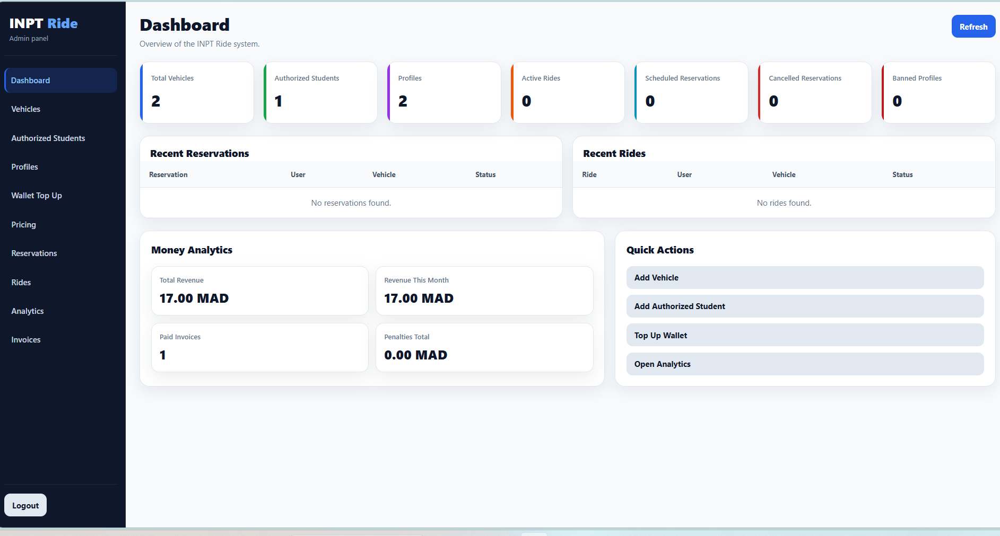

#### Fleet Management

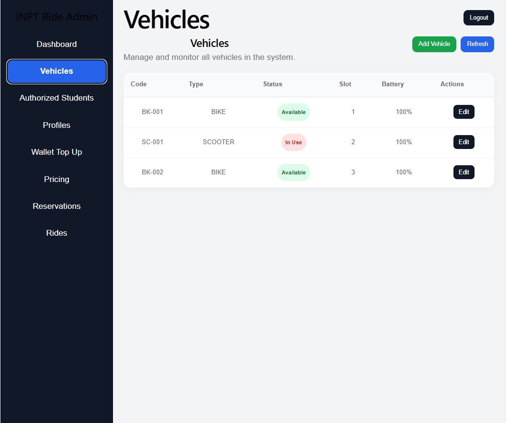

#### Ride Monitoring

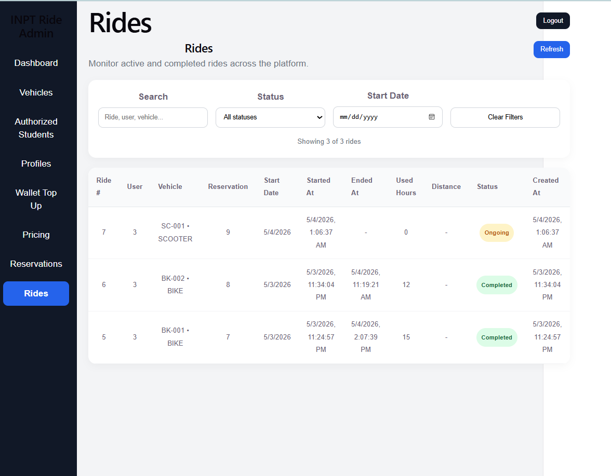

#### Revenue Analytics

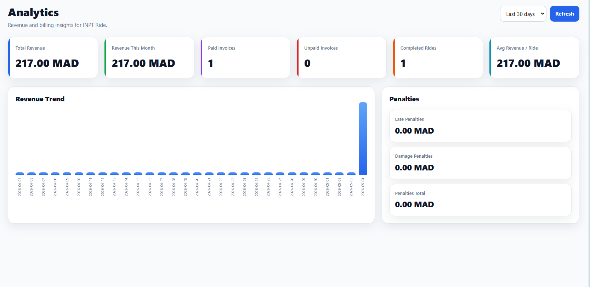

#### Student Mobile Home

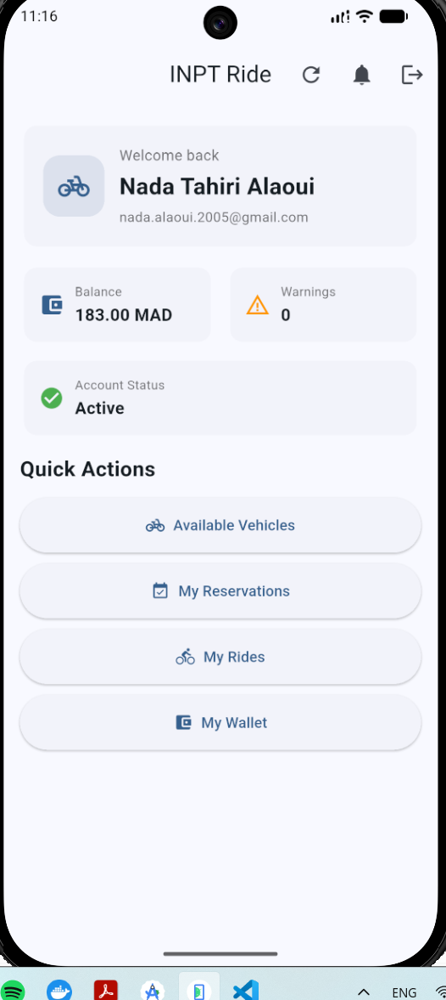

#### Available Vehicles

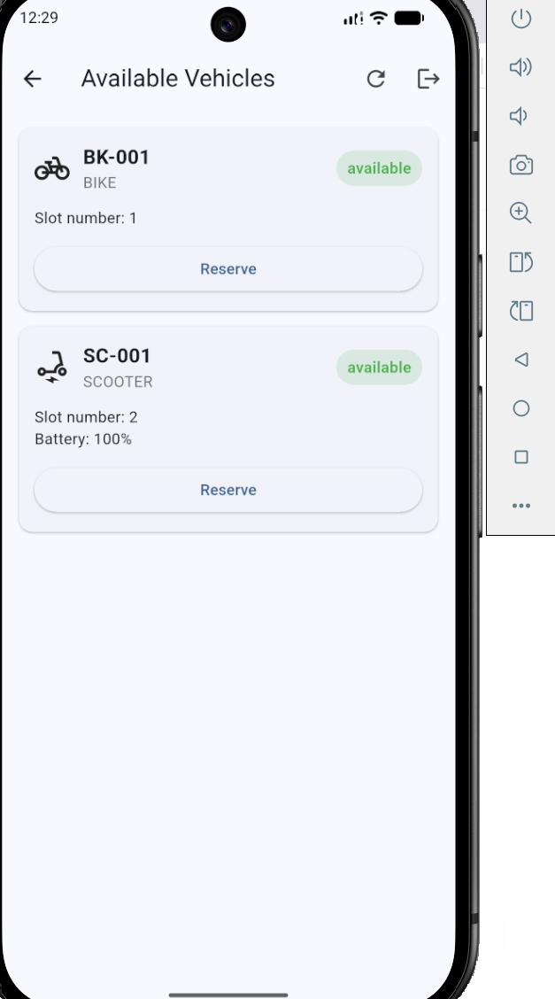

#### Wallet and Transactions

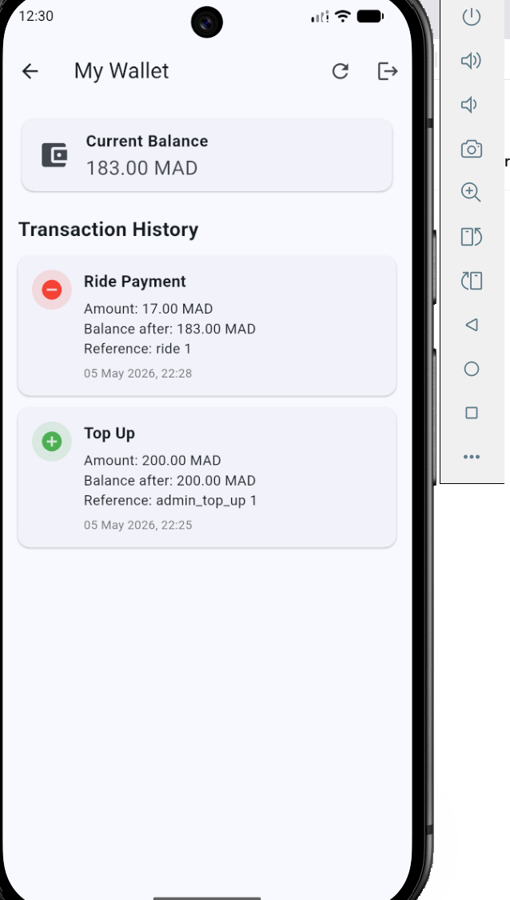

#### Notifications

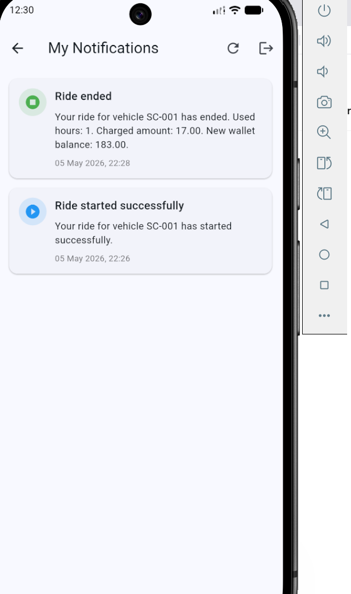

---

### DevOps Screenshots

#### Jenkins Jobs Overview

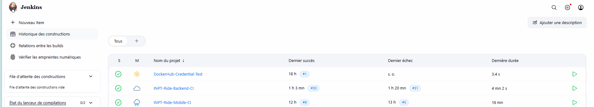

#### Backend DevSecOps Pipeline

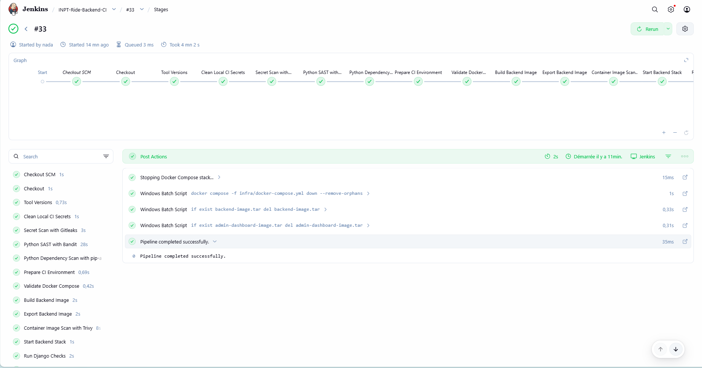

#### Mobile CI APK Artifact

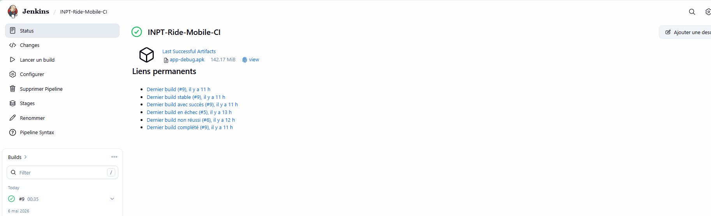

#### Docker Hub Repositories

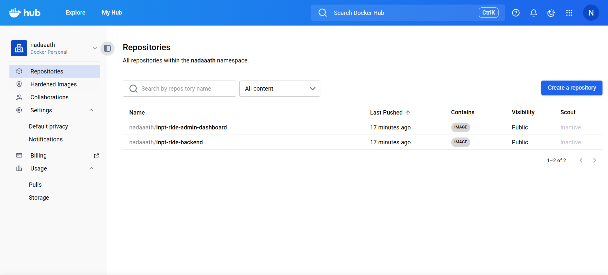

#### Docker Hub Backend Image

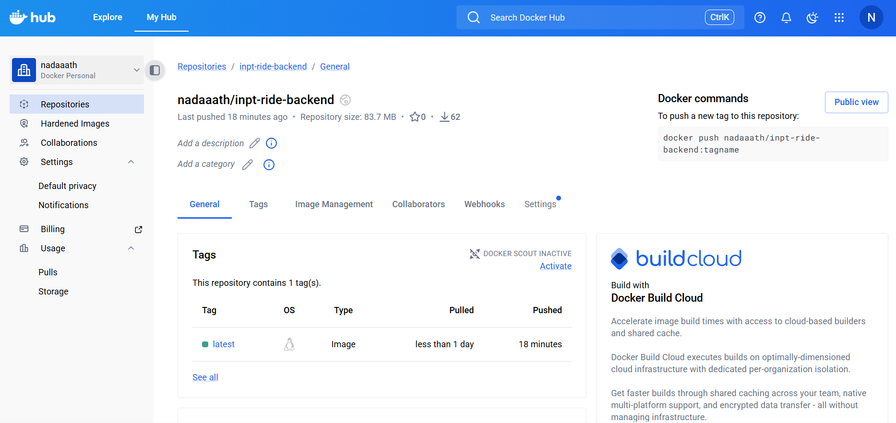

#### SonarCloud Quality Gate

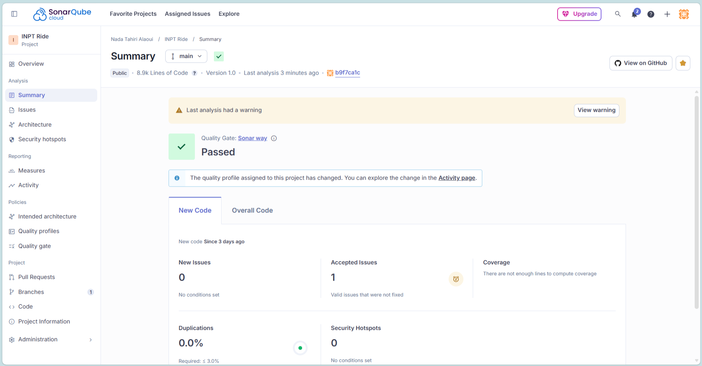

#### GitHub Actions SonarCloud Workflow

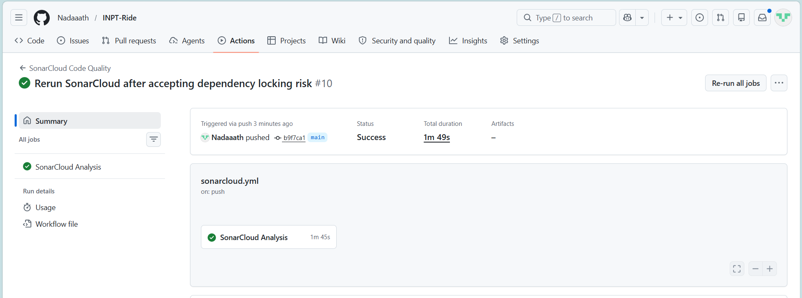

#### Kubernetes Pods Running


#### Kubernetes Ingress Health Endpoint


#### Argo CD Application Healthy and Synced


#### Argo CD Resource Tree


---

## Example Functional Flow

### Student Side

1. Sign in with Google.
2. Access is allowed only if the email is in authorized students.
3. Browse available vehicles.
4. Reserve a vehicle.
5. Start a ride.
6. End the ride.
7. Wallet is deducted.
8. Invoice is generated.
9. Notification is sent.

### Admin Side

1. Log in to dashboard.
2. Monitor dashboard KPIs.
3. Manage vehicles and authorized students.
4. Adjust pricing rules.
5. Monitor reservations and rides.
6. View invoices.
7. View analytics.

---

## Demo Script

A clean demo sequence for presentation:

1. Show the Docker Compose stack running.
2. Show the Jenkins backend/admin DevSecOps pipeline.
3. Show the Jenkins mobile CI APK artifact.
4. Show Docker Hub published images.
5. Show SonarCloud Quality Gate passing.
6. Show Kubernetes pods, services, ingress, and migration job.
7. Show the `/api/health/` endpoint through Ingress.
8. Show Argo CD Healthy/Synced application state.
9. Show Argo CD resource tree and explain GitOps sync.
10. Open the admin dashboard.
11. Show dashboard overview.
12. Show vehicles and pricing rules.
13. Show rides and analytics.
14. Open the student app.
15. Show student home, wallet, available vehicles, and notifications.
16. Explain reservation and ride flow.
17. Explain wallet deduction and invoice-backed analytics.

---

## Current Strengths of the Project

- end-to-end system with mobile, web, backend, and database
- realistic campus mobility use case
- admin and student roles
- vehicle reservation and ride lifecycle
- wallet deduction logic
- invoice-backed analytics
- pricing configuration
- Redis reservation locking
- modular backend organization
- real Django business tests
- health endpoint for operational checks
- Dockerized backend and admin dashboard
- Docker image optimization and hardening
- Nginx reverse proxy
- PostgreSQL and Redis services
- Jenkins backend/admin DevSecOps pipeline
- Jenkins mobile CI pipeline with APK artifact
- GitHub Actions SonarCloud Quality Gate
- secret scanning
- SAST scanning
- dependency vulnerability scanning
- Docker image vulnerability scanning
- full-stack smoke testing
- Docker Hub publishing
- production-like deployment using registry images
- Kubernetes deployment on Minikube
- ConfigMaps, Secrets, Services, Ingress, and migration Job
- Argo CD GitOps synchronization
- automated sync, pruning, and self-healing

---

## Future Improvements

- richer analytics charts
- invoice PDF export
- CSV import for authorized students
- improved mobile UI polish
- automated GitHub webhook trigger for Jenkins
- observability with Prometheus and Grafana
- PostgreSQL persistent storage with PVC for Kubernetes demo
- managed PostgreSQL service such as AWS RDS for production
- Kubernetes resource requests and limits
- Horizontal Pod Autoscaler for backend
- release versioning for Docker images instead of only `latest`
- deployment to a cloud VM or managed Kubernetes cluster
- production signing for mobile release builds
- external secret management for Kubernetes

---

## Author

**Nada Tahiri Alaoui**

Project focused on:

- mobile development
- backend systems
- business logic implementation
- full-stack architecture
- Docker and containerization
- Jenkins CI/CD
- DevSecOps pipeline design
- Kubernetes deployment
- Argo CD GitOps
- cloud / DevOps readiness
